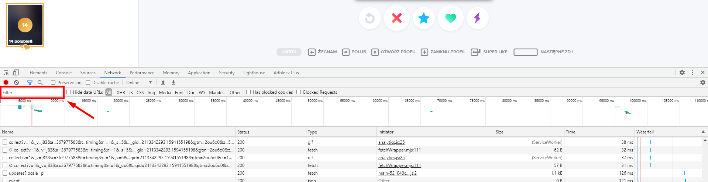
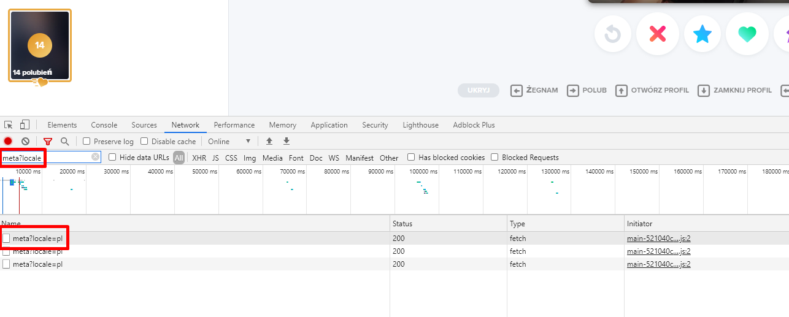
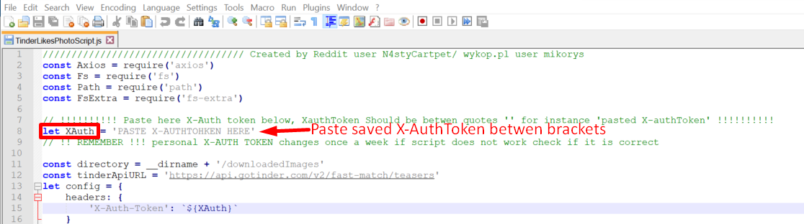
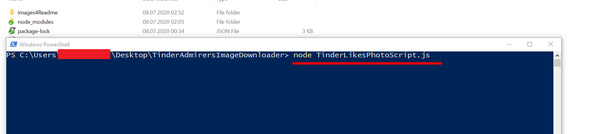
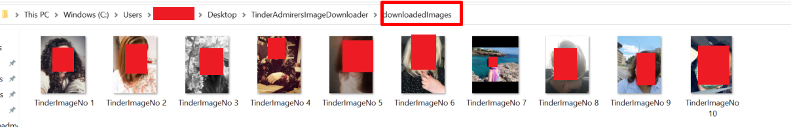
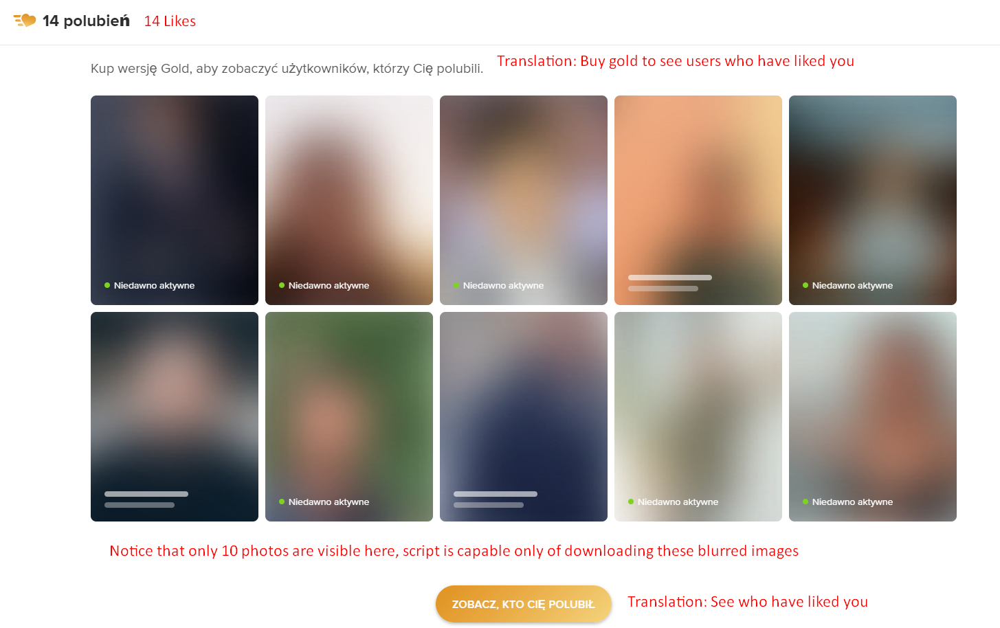

# TinderLikeImagesDownloader
**Script written by reddit user N4styCartPet/ wykop.pl user mikorys**
This script allows you to download photos of 10 last persons who has liked you\
**This script was tested on WINDOWS 10 it works for 8th July 2020**
**Should work on older Windows wersions too*

**In order to run script you need to perform following steps:**
1. Download and install node.js LTS version - https://nodejs.org/en/ 
2. **(Optional)** If you installed node JS for the first time on your machine, restart your PC 
3. Download repository and extract it to newly created folder 
4. Obtain X-auth token for your tinder account: Below you have instruction how to do that:\
  -3A. Open Google Chrome, open new empty tab and press "F12" - click on Network Tab\
  -3B. **(Optional)** If you haven not did it before log in to your tinder account using browser \
  -3C. Now in URL field paste tinder adress and click **Return/Enter key** - https://tinder.com/app/recs \
  -3D. In Filter searchField shown below paste following **text: meta?locale** \
  
  -3E. From listed results select firtst one and click it - Headers Tab should display\
  
  -3D. Scroll down to Section called **Request headers**, if its not opened do it and scroll down until you find X-Auth-token, copy it and save somewhere. You will need it later.
  
5. Open downloaded repository, and open **TinderLikesPhotoScript** by clicking right mous button on and selection option "Open with" then choose notepad or use notepad++ if you own one 
6. In code locate variable XAuth (line 8), **paste your saved token betwen brackets** and **save** edited file 

7. Now on empty space in folder click following combination **Ctrl** + **Shift**  + **Right mouse button** and select **Open PowerShell/Comand line window here**- Powershell/CMD window should open, depends on your windwos version
8. Click on empty field and type in following comand **node TinderLikesPhotoScript.js** and click **Return/Enter key** 

9. Script should download latest pictures of 10 persons who have liked you or less if you have less than 10 likes. Notice that new folder **downloadedImages** was created in the directory 

10. Open newly created folder to see downloaded photos. **!!! voilà - ENJOY!!!**

**!!!!!! IMPORTANT !!!!!!**
**X-AUTH-TOKEN** Changes once a week so if script returns error make sure that your X-AuthKey is updated

**FAQ**
1.Is it possible to download more than 10 photos? - Unfrotunatell no, script shows everyone who is blurred when you hit- see screenshot below

2. Does it work on MAC, I'm not familliar with MAC OS so I have no idea.

**PS: I am not JS expert rather beginner, but I've have chosen this language because it's easy to set up comparing to JAVA/C#**
